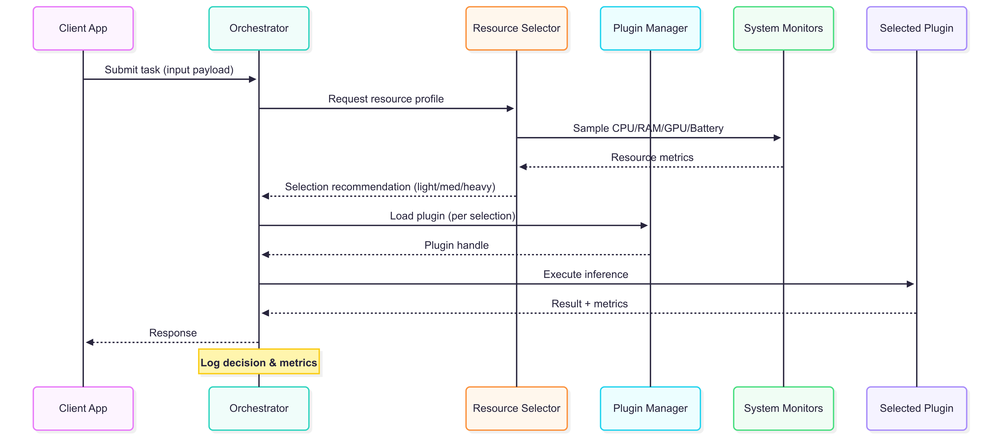
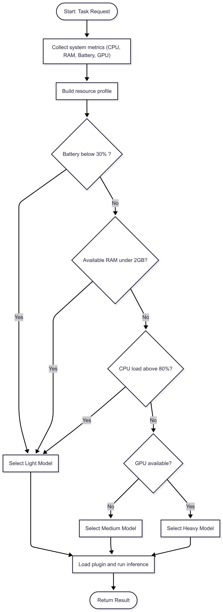

<div align="center">

# Lightweight AI Plugin Framework

> **Resource-aware AI runtime for edge devices**

</div>

A modular, resource-aware AI runtime that dynamically selects the optimal model for your device based on real-time CPU, memory, and battery levels.

---

## Why?

Edge devices have **limited and fluctuating resources**. This framework solves that by:

- **Auto-switching** between light / medium / heavy models based on system load
- **Hot-swapping** plugins at runtime without restart
- **Cross-platform** — Linux, Windows, Android, macOS

---

## Quick Start

```bash
pip install -r requirements.txt   # optional: psutil; monitors fall back to /proc, Win32, vm_stat
python main.py "some input"
python main.py "some input" --watch 5   # re-check resources every 5s, swapping models as load changes
python -m unittest discover -s tests -t .
```

Or with Docker:

```bash
docker build -t lightweight-ai-plugins .
docker run --rm lightweight-ai-plugins "some input"
```

The orchestrator monitors your system and selects the right model automatically.

### Configuration (environment variables)

| Variable | Default | Meaning |
|----------|---------|---------|
| `FORCE_MODEL` | — | Skip selection and use `light` / `medium` / `heavy` |
| `MIN_BATTERY_PERCENT` | 30 | Below this → light |
| `MIN_RAM_GB` | 2 | Below this → light |
| `MAX_CPU_PERCENT` | 80 | Above this → light |
| `HEAVY_MIN_RAM_GB` | 4 | Heavy needs at least this much free RAM |
| `HEAVY_MAX_CPU_PERCENT` | 50 | Heavy needs CPU at or below this |
| `LOG_LEVEL` | INFO | Logging verbosity |

### Models

Drop real models into `models/` (`light.pt` TorchScript, `medium.tflite`, `heavy.onnx`) and install the matching runtime
(`torch`, `tflite-runtime`, `onnxruntime`). If the file is empty or the runtime is missing, the plugin runs in dummy mode
and echoes its input.

### Adding a plugin

Create `plugins/<name>_model/__init__.py` with a `PluginInterface` subclass whose `name = "<name>"`, and expose it as
`Plugin = YourClass`. The plugin manager discovers it automatically.

---

## Architecture




```
Core Layer     → Plugin management, decision logic
Plugin Layer   → Individual AI models (light/medium/heavy)
System Layer   → Platform-specific resource monitoring
Interfaces     → Abstract contracts for plugins & monitors
```

### Decision Logic

| Condition | Selected Model |
|-----------|---------------|
| Battery < 30% | Light |
| RAM < 2 GB | Light |
| CPU load > 80% | Light |
| GPU available + RAM ≥ 4 GB + CPU ≤ 50% | Heavy |
| Otherwise | Medium |

---

## Tech Stack

**Python** — ONNX Runtime · TensorFlow Lite · PyTorch  
**System** — `psutil`, platform APIs, `/proc`  
**Packaging** — Docker

---

## Project Structure

```
├── core/          # Orchestrator & plugin management
├── plugins/       # AI model plugins (light/medium/heavy)
├── models/        # Model files (placeholders)
├── interfaces/    # Abstract base classes
├── system/        # Resource monitoring (Linux, Windows, Android, macOS)
├── utils/         # Logger
├── tests/         # Unit tests
├── main.py        # Entry point
├── Images/        # Architecture diagrams
└── requirements.txt
```

---

## License

MIT — open for collaboration. PRs welcome, especially on model optimization and multi-platform support.
